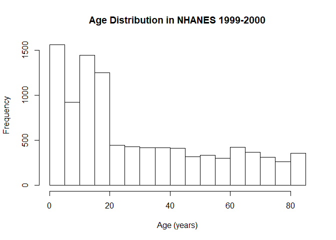

Data from Continuous NHANES (Years 1999-2016)
================
Dane Van Domelen <br> <vandomed@gmail.com> <br>
2020-02-23

<!-- README.md is generated from README.Rmd. Please edit that file -->

## Installation

You can install **nhanesdata** from GitHub by running:

``` r
devtools::install_github("vandomed/nhanesdata")
```

## Brief summary

The National Health and Nutrition Examination Survey (NHANES) is an
ongoing, nationally representative study of Americans. Since 1999,
NHANES has collected cross-sectional data in 2-year cycles, with roughly
10,000 participants included in each cycle. The data is freely available
to download from the [NHANES
website](https://wwwn.cdc.gov/nchs/nhanes/continuousnhanes/default.aspx?BeginYear=1999),
but the source files are large, and it’s tedious going through and
individually downloading each file that includes a variable you’re
interested in.

This package simply includes (virtually) all of the data from 1999-2016.
Once you install the package, you can access any dataset in R by
referring to the file name of interest. For example, the demographics
files are named `demo` for 1999-2000, `demo_b` for 2001-2002, `demo_c`
for 2003-2004, and so on. So if you want to, say, generate a histogram
of age for the 1999-2000 cycle, you can run:

``` r
hist(demo$RIDAGEYR, main = "Age Distribution in NHANES 1999-2000", xlab = "Age (years)")
```

<!-- -->

# Updates

The datasets are current as of Feb. 22, 2020. I plan to check for
updates and new datasets every few months. Please note that data from
the 2017-2018 cycle has not yet been released.
